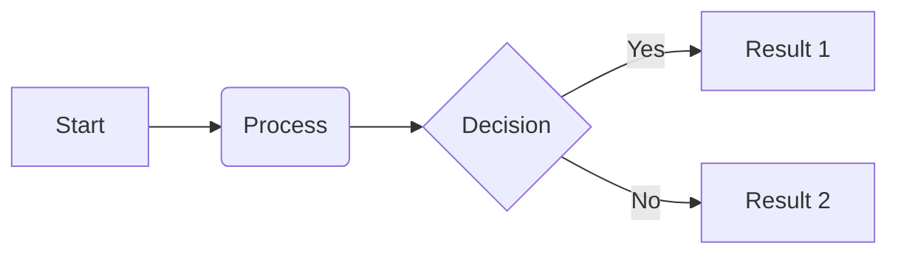

# H1: The Quick Brown Fox
## H2: The Quick Brown Fox
### H3: The Quick Brown Fox
#### H4: The Quick Brown Fox
##### H5: The Quick Brown Fox
###### H6: The Quick Brown Fox

---

## TYPOGRAPHY AND INLINE ELEMENTS
This paragraph tests **bold text**, *italicized text*, and ***combined emphasis***. You might also see ~~strikethrough~~ or ==highlighted text==. In Obsidian, we use [[Internal Links]] and [[Internal Links|Aliases]] frequently.

Here is `inline code` and a [hyperlink](https://obsidian.md).


---

## LISTS AND TASKS
- Unordered List Item
- Sub-item with indentation
- Deeply nested item
- Second main item

**1**. Ordered List Item 1

1. Ordered List Item 2
2. Nested Ordered Item

- ✅ Standard completed task (`x`)
- 🔲 Standard incomplete task ( )
- [/] In-progress task (`/`)
- [-] Canceled / Striking task (`-`)
- [?] Question / Help (`?`)
- [i] Information (`i`)
- [I] Idea / Lightbulb (`I`)
- [P] Open Pull Request (`P`)
- [!] Important / Warning (`!`)
- [>] Rescheduled / Forwarded (`>`)
- [<] Scheduled / Calendar (`<`)
- [u] Trend Up (`u`)
- [d] Trend Down (`d`)
- ⭐️ Star / Favorite (`*`)
- [b] Bookmark (`b`)
- ["] Quote (`"`)
- [l] Location (`l`)
- [P] Open Pull Request (`P`)
- [M] Merged Pull Request (`M`)
- [D] Draft Pull Request (`D`)
- [f] Fire / Urgent (`f`)
- [k] Key / Critical (`k`)
- [w] Win / Celebration (`w`)
- [S] Savings / Money (`S`)
- [p] Pro / Thumbs Up (`p`)
- [c] Con / Thumbs Down (`c`)


---

## ALL CALLOUT TYPES
> [!note]
> This is a note.

> [!note]
> This is an abstract/summary/tldr.

> [!info]
> This is information.

> [!info]
> This is a todo.

> [!info]
> This is a tip/hint/important.

> [!success]
> This is success/check/done.

> [!note]
> This is a question/help/faq.

> [!warning]
> This is a warning/caution/attention.

> [!error]
> This is a failure/fail/missing.

> [!warning]
> This is danger/error.

> [!warning]
> This is a bug.

> [!note]
> This is an example.

> [!note]
> This is a quote/cite.


---

## TABLES
| Feature | Description   | Status    | Align  |
| ------- | ------------- | --------- | ------ |
| Tables  | Core Markdown | Supported | Right  |
| Mermaid | Diagrams      | Plugin    | Center |
| MathJax | Equations     | Core      | Left   |

---

## CODE AND MATH
```python
def stress_test():
    """Testing syntax highlighting for code blocks"""
    elements = ["H1", "Lists", "Tables", "Callouts"]
    for e in elements:
        print(f"Testing {e}...")
    return True
```




## FOOTNOTES
This sentence requires a footnote [^1]. This one requires another [^2].

[^1]: This is the first footnote.
[^2]: This is a second, longer footnote to test word-wrapping within the footnote section at the bottom of the document.


