# Why Markdown + Obsidian + Quartz?

This site is a working demo of a documentation approach built on three tools. The goal is simple: **engineering docs that engineers actually maintain**.

---

## The Problem With the Alternatives

| Tool | Pain |
|---|---|
| **Confluence** | Slow, expensive, pages rot silently, no graph, terrible DX for engineers |
| **Notion** | Walled garden, limited export, no git integration, not built for technical content |
| **READMEs per repo** | Siloed — no way to link across codebases, no search across repos, no visualisation |
| **Google Docs / Sharepoint** | No code blocks, no versioning, no ownership model |

The common failure mode: docs live somewhere engineers don't naturally go, so they don't get updated, so engineers stop trusting them, so they stop reading them, so they stop writing them.

---

## The Toolchain

```mermaid
flowchart LR
    subgraph Write["✍️ Write"]
        Obsidian["Obsidian\nMarkdown editor"]
        Files["Plain .md files\nwikilinks · tags · aliases"]
    end

    subgraph Store["📦 Store"]
        Git["Git\nversion control"]
        GitHub["GitHub repo\nPR reviews for docs"]
    end

    subgraph Build["⚙️ Build"]
        Actions["GitHub Actions\nCI pipeline"]
        Quartz["Quartz v4\nstatic site generator"]
        Staticrypt["staticrypt\npassword protection"]
    end

    subgraph Serve["🌐 Serve"]
        Pages["GitHub Pages\nfree hosting"]
    end

    subgraph Read["👀 Read"]
        Browser["Engineers\nbrowser · search · graph"]
    end

    Obsidian -->|author| Files
    Files -->|commit + push| Git
    Git --> GitHub
    GitHub -->|trigger on push| Actions
    Actions --> Quartz
    Quartz -->|compiles to HTML| Staticrypt
    Staticrypt -->|encrypted static site| Pages
    Pages -->|HTTPS| Browser
```

Each layer does one thing well. No proprietary formats. No lock-in. No running servers.

---

## Why It Scales

### 1. Plain files, infinite headroom
Every note is a `.md` file on disk. There is no database to back up, no CMS to upgrade, no vendor to negotiate with. The entire knowledge base is a folder you can open in any editor.

### 2. Cross-codebase links that actually work
Wikilinks (`[[Note Name]]`) create explicit, navigable relationships between concepts across codebases. When [[nourish-studio/Data Points Editor|Nourish Studio]] defines a [[better-care/Data Points|Data Point]] that [[better-care/index|Better Care]] consumes, that relationship is a first-class link — not a comment in a Slack thread.

Quartz renders these as a **graph view** showing the entire knowledge graph at once.

### 3. Search by name, alias, or content
Every note carries `aliases` in its frontmatter. Searching "DP", "data point", or "observation type" all surface the same [[better-care/Data Points|Data Points]] note. Full-text search covers all content.

### 4. Version control is doc control
Docs live in Git alongside (or adjacent to) code. That means:
- Every change has an author, a timestamp, and a reason
- Doc reviews happen in pull requests — the same workflow engineers already use
- You can `git blame` a decision and find out who made it and when
- Rollback a bad doc change the same way you roll back a bad code change

### 5. Low friction for engineers
Engineers already know Markdown. There's nothing new to learn — no CMS login, no WYSIWYG editor that mangles your code blocks, no "please format as per the Confluence template". Open a file, write, commit.

---

## What Quartz Adds

Quartz turns the flat folder of Markdown into a navigable site with zero configuration beyond what's already in the notes:

- **Graph view** — visual map of every link between notes
- **Backlinks** — every note shows what links to it
- **Tag pages** — browse all notes tagged `#runbook`, `#adr`, `#api`, etc.
- **Folder index pages** — each codebase folder auto-generates a contents page
- **Popovers** — hover any link to preview the linked note without navigating away
- **Table of contents** — auto-generated from headings
- **Mermaid diagrams** — rendered natively (see [[better-care/Architecture]], [[empower/Shift Scheduling Engine]])
- **Syntax highlighting** — code blocks with language-aware highlighting

---

## What Obsidian Adds (Optional)

Obsidian is the local editing layer — it is **not required** to use this system. Any text editor works. Obsidian adds:

- Live graph view while writing
- Wikilink autocomplete
- Local preview of the rendered site
- Plugin ecosystem (tables, kanban, daily notes) if you want it

The key principle: **the notes are the product, not the editor**. Switching editors never costs you your docs.

---

## This Demo

This site documents three fictional but realistic Nourish codebases — [[better-care/index|Better Care]], [[empower/index|Empower]], and [[nourish-studio/index|Nourish Studio]] — to show how the approach handles:

- Multiple codebases in one knowledge base
- Cross-codebase concepts (see [[better-care/Data Points]])
- Rich technical content (ER diagrams, sequence diagrams, API references, runbooks)
- ADRs with context and rationale
- Search and navigation at scale
