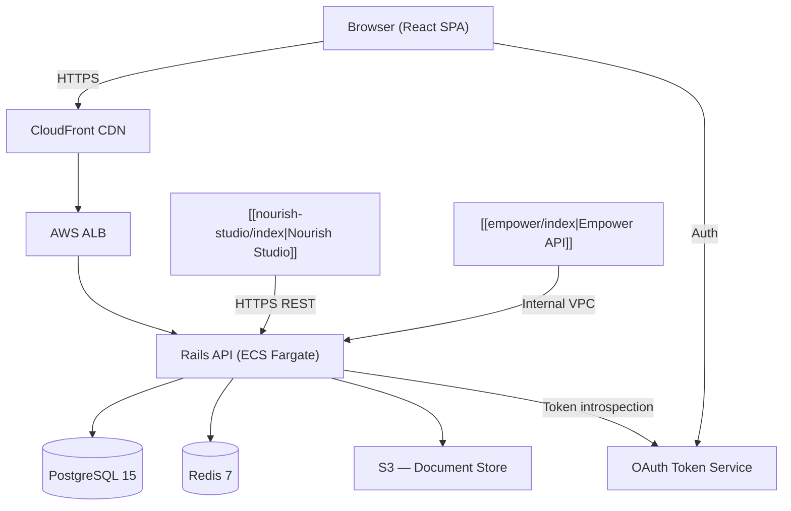

# Better Care — Architecture

## System Overview

Better Care is a monolithic Rails API consumed by a single-page React frontend. The system is intentionally kept as a well-structured monolith — bounded contexts are enforced via Rails engines and service objects, not microservices.

---

## Authentication

All requests are authenticated via **OAuth 2.0 Bearer tokens** issued by the central Nourish Token Service.

- The React SPA redirects to the Token Service for login (PKCE flow).
- API requests include `Authorization: Bearer <token>`.
- The Rails API introspects tokens against `/oauth/introspect` on every request (cached in Redis for 60 s).
- [[nourish-studio/index|Nourish Studio]] uses the **Client Credentials** grant for its machine-to-machine calls.
- [[empower/index|Empower]] uses a shared service account token issued from the same Token Service.

> [!warning] Token cache invalidation
> If a user is deactivated, their token remains valid for up to 60 s due to Redis caching. The on-call runbook covers force-invalidation. See [[Runbook#Force Token Invalidation]].

---

## Bounded Contexts (Rails Engines)

| Engine | Responsibility |
|---|---|
| `CareEngine` | Care plans, assessments, goals |
| `MedicationEngine` | MAR charts, prescriptions, e-signatures |
| `ObservationEngine` | [[Data Points]], vitals, recorded observations |
| `ResidentEngine` | Core resident profile, admissions, discharges |
| `IncidentEngine` | Incident recording and reporting |
| `StaffEngine` | Read-only projection of staff from [[empower/index|Empower]] |

---

## Background Jobs

Sidekiq (backed by Redis) handles all async work:

| Queue | Purpose |
|---|---|
| `critical` | E-signature confirmations, medication alerts |
| `default` | Report generation, PDF exports |
| `low` | Analytics event forwarding, audit log writes |

---

## Key Design Decisions

- [[ADR-001 Adopting PostgreSQL]] — PostgreSQL over MySQL for JSONB support (used heavily in [[Data Points]]).
- [[ADR-002 React Query for State]] — React Query manages server state; Zustand handles ephemeral UI state only.
