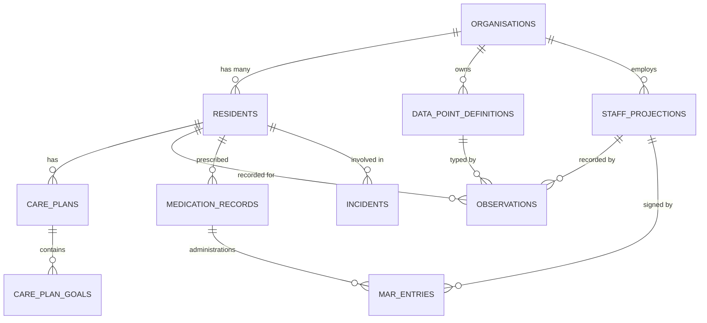

# Better Care — Data Model

## Entity Relationship Overview



---

## Key Tables

### `residents`

| Column | Type | Notes |
|---|---|---|
| `id` | `uuid` | Primary key |
| `org_id` | `uuid` | FK → `organisations` |
| `nhs_number` | `varchar(10)` | Nullable; encrypted at rest |
| `first_name` | `varchar` | Encrypted at rest |
| `last_name` | `varchar` | Encrypted at rest |
| `date_of_birth` | `date` | |
| `admission_date` | `date` | |
| `discharge_date` | `date` | Null if current resident |
| `care_level` | `enum` | `residential`, `nursing`, `dementia` |

### `data_point_definitions`

| Column | Type | Notes |
|---|---|---|
| `id` | `uuid` | |
| `org_id` | `uuid` | FK → `organisations` |
| `name` | `varchar` | Display name |
| `slug` | `varchar` | URL-safe identifier, unique per org |
| `schema` | `jsonb` | Field definitions (see [[Data Points]]) |
| `alert_rules` | `jsonb` | Threshold alert config |
| `deprecated_at` | `timestamp` | Soft-delete for schema migrations |

### `observations`

| Column | Type | Notes |
|---|---|---|
| `id` | `uuid` | |
| `resident_id` | `uuid` | FK → `residents` |
| `data_point_definition_id` | `uuid` | FK → `data_point_definitions` |
| `value` | `jsonb` | Validated against `schema` |
| `recorded_by` | `uuid` | FK → `staff_projections` |
| `recorded_at` | `timestamptz` | |
| `notes` | `text` | Optional free-text annotation |

---

## Encryption

Columns marked *encrypted at rest* use the `attr_encrypted` gem with AES-256-GCM. The encryption key is sourced from AWS Secrets Manager at boot and rotated quarterly.

> [!warning] Querying encrypted columns
> Encrypted columns cannot be used in `WHERE` clauses directly. Use the `encrypted_search_token` shadow column (a deterministic HMAC hash) for lookups. See `app/models/concerns/searchable_encrypted.rb`.

---

## Indexes of Note

```sql
-- Fast lookup of observations by resident + time range (most common query)
CREATE INDEX idx_observations_resident_recorded 
  ON observations (resident_id, recorded_at DESC);

-- Partial index for active (non-deprecated) data point definitions
CREATE INDEX idx_dp_definitions_active 
  ON data_point_definitions (org_id, slug) 
  WHERE deprecated_at IS NULL;
```
