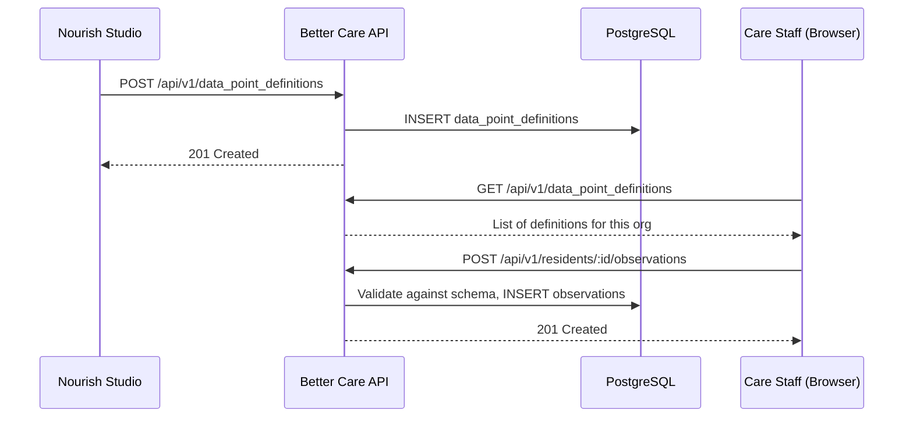

# Data Points

Data Points are the configurable observation measurement types used throughout Better Care. Rather than hard-coding clinical measurements (e.g. blood pressure, weight, mood score), Better Care exposes a schema-driven system where care home operators define their own measurement types via [[nourish-studio/index|Nourish Studio]].

This is one of the most important cross-codebase concepts in the Nourish platform. The Data Point *schema* is owned here in Better Care; the *authoring UI* lives in [[nourish-studio/Data Points Editor|Nourish Studio's Data Points Editor]].

---

## Anatomy of a Data Point

Each Data Point is stored in PostgreSQL as a row in `data_point_definitions`, with a JSONB `schema` column describing the measurement's shape:

```json
{
  "id": "uuid",
  "name": "Blood Pressure",
  "slug": "blood-pressure",
  "unit": "mmHg",
  "schema": {
    "type": "composite",
    "fields": [
      { "key": "systolic",  "type": "integer", "min": 60,  "max": 250 },
      { "key": "diastolic", "type": "integer", "min": 40,  "max": 150 }
    ]
  },
  "alert_rules": [
    { "condition": "systolic > 180", "severity": "high", "notify": ["nurse", "gp"] }
  ],
  "org_id": "uuid",
  "created_by": "nourish-studio"
}
```

### Field Types

| Type | Description | Example |
|---|---|---|
| `integer` | Whole number with optional min/max | Blood pressure, pulse |
| `decimal` | Floating point value | Weight (kg), temperature |
| `enum` | Predefined list of options | Pain scale (none/mild/moderate/severe) |
| `boolean` | Yes/No | Appetite present |
| `text` | Free text entry | Behaviour notes |
| `composite` | Multiple sub-fields in one observation | Blood pressure (systolic + diastolic) |

---

## Data Flow



---

## Alert Rules

Data Points can carry `alert_rules` — threshold conditions that trigger notifications when an observation is recorded:

```ruby
# app/services/observation_engine/alert_evaluator.rb
class ObservationEngine::AlertEvaluator
  def evaluate(observation)
    observation.data_point_definition.alert_rules.each do |rule|
      next unless rule.condition_met?(observation.value)
      AlertNotificationJob.perform_later(
        observation: observation,
        severity: rule.severity,
        recipients: rule.notify
      )
    end
  end
end
```

> [!warning] Schema migrations
> Changing a Data Point's schema after observations have been recorded is a **breaking change**. The `DataPointDefinition#update` endpoint rejects schema changes if `observations_count > 0`. Operators must create a new Data Point and deprecate the old one.

---

## API

See [[API Reference#Data Points]] for the full endpoint reference.

---

## Related

- [[nourish-studio/Data Points Editor]] — The UI where operators author Data Point definitions
- [[Data Model#data_point_definitions]] — Database schema
- [[Architecture#ObservationEngine]] — The Rails engine that owns this domain
