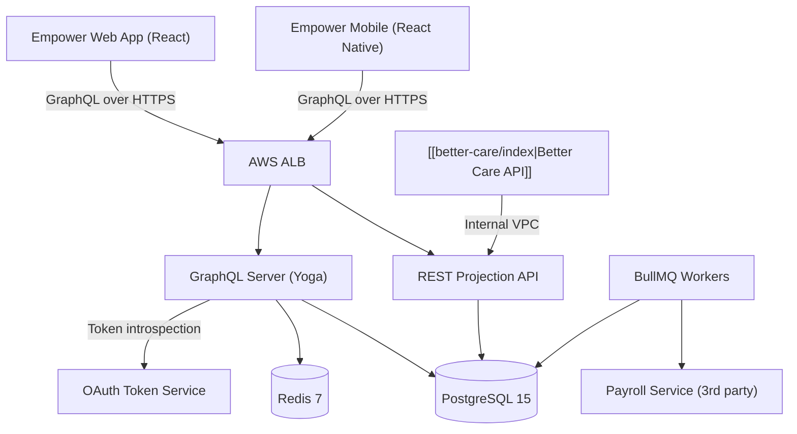
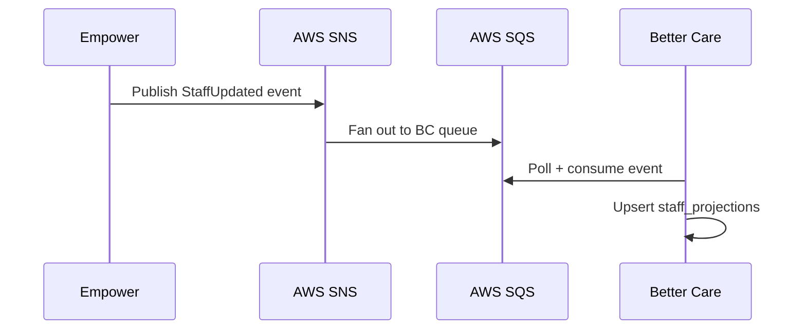

# Empower — Architecture

## System Overview

Empower is a **Node.js + Fastify** service exposing a **GraphQL API** for its primary clients (the Empower web app and mobile app) and a lightweight **REST API** for internal Nourish platform integrations.

---

## GraphQL Layer

The GraphQL schema is code-first using **Pothos** with the Prisma plugin. Resolvers are split by domain:

| Module | Key types |
|---|---|
| `staff` | `StaffMember`, `StaffProfile`, `Qualification` |
| `scheduling` | `Shift`, `Rota`, `ShiftAssignment` |
| `timesheets` | `Timesheet`, `ClockEntry`, `PayrollExport` |
| `compliance` | `DBS`, `Training`, `RightToWork` |

### DataLoader pattern

All N+1 queries are eliminated via **DataLoader**. Every resolver that fetches a related entity must use the relevant loader from `src/dataloaders/`. Adding a resolver without a loader is a lint error (`eslint-plugin-nourish/require-dataloader`).

---

## Better Care Integration

Better Care consumes staff data via a **REST projection endpoint** (`/internal/v1/staff-projections`) — a simplified, denormalised view of the staff table designed for Better Care's read pattern.

The sync mechanism is **event-driven**:

Events are published on: staff created, profile updated, employment ended.

> [!info] Eventual consistency
> Better Care's staff projections are eventually consistent with Empower. In practice, lag is <30 s under normal load.

---

## Background Jobs (BullMQ)

| Queue | Purpose |
|---|---|
| `compliance-alerts` | Daily DBS/training expiry checks, notification dispatch |
| `payroll-export` | Weekly payroll file generation and SFTP transfer |
| `timesheet-aggregation` | Nightly timesheet roll-up from clock entries |
| `rota-publish` | Async rota generation from [[Shift Scheduling Engine]] |

---

## Key Design Decisions

- [[ADR-001 GraphQL Migration]] — Why Empower moved to GraphQL for its primary API
