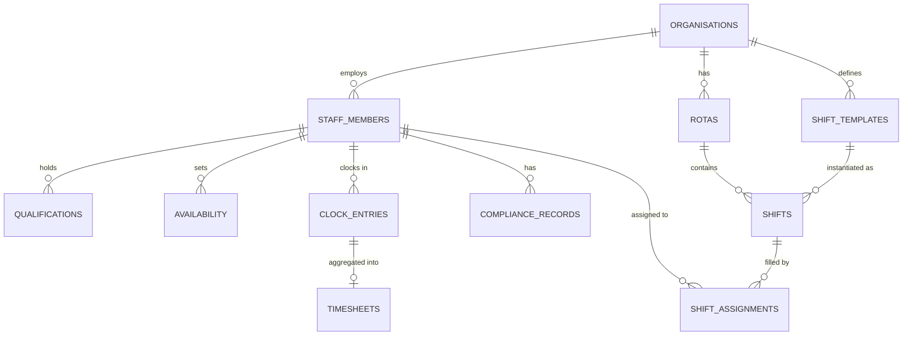

# Empower — Data Model

## Entity Relationship Overview



---

## Key Tables

### `staff_members`

The canonical staff identity record. This `id` is referenced across the entire Nourish platform.

| Column | Type | Notes |
|---|---|---|
| `id` | `uuid` | Platform-wide staff identity |
| `org_id` | `uuid` | FK → `organisations` |
| `employee_number` | `varchar` | Org-assigned, unique per org |
| `email` | `varchar` | Work email, encrypted |
| `role` | `enum` | `care_assistant`, `senior_carer`, `nurse`, `manager` |
| `employment_status` | `enum` | `active`, `on_leave`, `terminated` |
| `contracted_hours` | `decimal` | Weekly contracted hours |

### `shifts`

An individual shift slot within a rota, potentially unassigned.

| Column | Type | Notes |
|---|---|---|
| `id` | `uuid` | |
| `rota_id` | `uuid` | FK → `rotas` |
| `shift_template_id` | `uuid` | FK → `shift_templates` |
| `starts_at` | `timestamptz` | |
| `ends_at` | `timestamptz` | |
| `required_role` | `enum` | Minimum role required |
| `required_staff_count` | `integer` | |
| `status` | `enum` | `unfilled`, `assigned`, `confirmed` |

### `compliance_records`

| Column | Type | Notes |
|---|---|---|
| `id` | `uuid` | |
| `staff_member_id` | `uuid` | FK → `staff_members` |
| `type` | `enum` | `dbs`, `moving_handling`, `fire_safety`, `first_aid`, ... |
| `issued_at` | `date` | |
| `expires_at` | `date` | Nullable for non-expiring records |
| `status` | `enum` | `valid`, `expiring_soon`, `expired` |

---

## Prisma Schema Fragment

```prisma
model StaffMember {
  id               String     @id @default(uuid())
  orgId            String     @map("org_id")
  employeeNumber   String     @map("employee_number")
  role             StaffRole
  employmentStatus EmploymentStatus @map("employment_status")
  contractedHours  Decimal    @map("contracted_hours")

  qualifications    Qualification[]
  shiftAssignments  ShiftAssignment[]
  complianceRecords ComplianceRecord[]
  clockEntries      ClockEntry[]

  @@unique([orgId, employeeNumber])
  @@map("staff_members")
}
```
