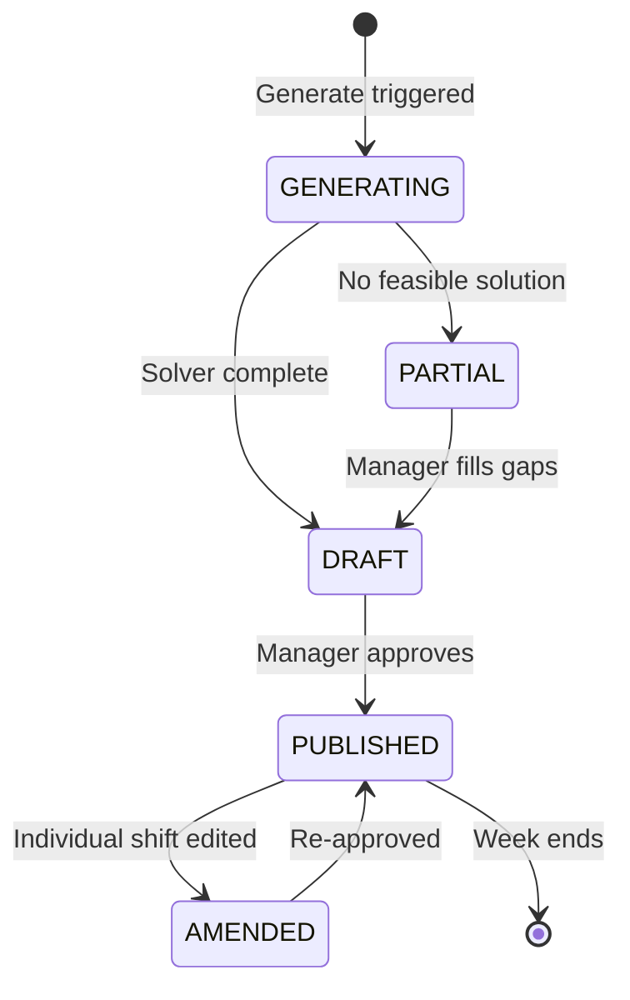

# Shift Scheduling Engine

The Shift Scheduling Engine is the algorithmic heart of Empower. It takes a set of **constraints** (shift requirements, staff availability, qualifications, Working Time Regulations) and produces an **optimal rota assignment** using a constraint satisfaction solver.

---

## How It Works

Scheduling runs are triggered in three ways:

1. **Manual** — A rota manager clicks "Generate Rota" in the Empower web app.
2. **Scheduled** — A BullMQ job runs every Monday at 06:00 to generate the following week's draft rota.
3. **Re-schedule** — Triggered automatically when a staff member calls in sick and no cover is set.

The engine is intentionally **async** — generating a rota is a `rota-publish` BullMQ job. Clients subscribe to rota status via a GraphQL subscription.

---

## Constraint Model

Constraints are ranked by priority:

| Priority | Constraint | Configurable |
|---|---|---|
| Hard | Staff member not available (leave, sickness) | No |
| Hard | Minimum rest period (11 hrs between shifts) | No (WTR) |
| Hard | Maximum weekly hours (48 hrs) | No (WTR) |
| Hard | Required qualification for shift type | Yes (per org) |
| Soft | Staff member's preferred shift pattern | Yes (per staff) |
| Soft | Balanced distribution across team | Yes (per org) |
| Soft | Minimise overtime cost | Yes (per org) |

Hard constraints **must** be satisfied. Soft constraints are scored — the engine maximises the total soft-constraint score.

---

## Algorithm

The engine uses **Google OR-Tools CP-SAT** solver via a Node.js native binding (`node-or-tools`). The problem is modelled as a Constraint Programming (CP) problem:

```
Variables:   assignment[staff][shift] ∈ {0, 1}
Objective:   maximise Σ soft_scores
Constraints: ∀ shift: Σ assignment[s][shift] == required_staff_count[shift]
             ∀ staff: hard_constraints satisfied
```

For a typical weekly rota (30 staff, 21 shifts), the solver runs in under 2 seconds. For larger orgs (100+ staff), a 10-second time limit is imposed and the best partial solution is returned.

> [!info] Fallback
> If the solver cannot find a feasible solution (e.g. too few qualified staff), the engine returns a `PARTIAL` rota with unfilled shifts flagged. The rota manager is notified to fill gaps manually.

---

## Rota Lifecycle



---

## Integration with Better Care

When a rota is published, the assigned staff IDs are propagated to [[better-care/index|Better Care]] via the SNS event bus. Better Care uses this to pre-populate shift context for care plan handovers. Staff identity is always referenced by Empower's `staff_id` — see [[Architecture#Better Care Integration]].
