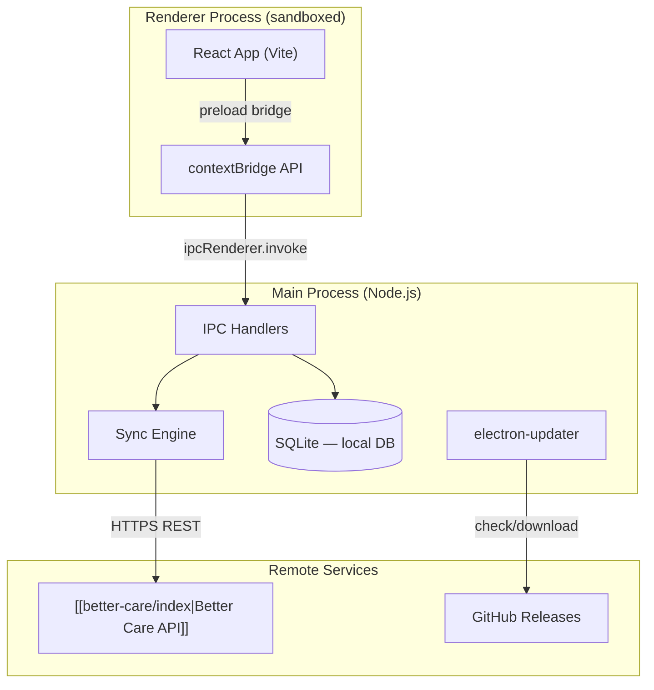
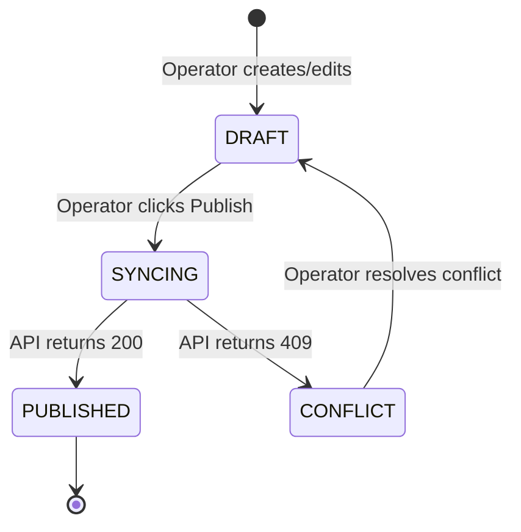

# Nourish Studio — Architecture

## Electron Process Model

Studio follows Electron's **main + renderer** model with a strict context isolation boundary. All Node.js and native APIs are accessed from the main process only — the renderer runs as a sandboxed browser context.

---

## IPC Design

The renderer never calls Node.js APIs directly. All side effects (disk, network, SQLite) go through named IPC channels defined in `src/main/ipc/`:

| Channel | Direction | Description |
|---|---|---|
| `dp:list` | main → renderer | Fetch Data Point definitions from local SQLite |
| `dp:save` | renderer → main | Save a draft Data Point to SQLite |
| `dp:publish` | renderer → main | Push a Data Point to [[better-care/index\|Better Care API]] |
| `org:settings` | main → renderer | Fetch org config from SQLite |
| `sync:status` | main → renderer | Broadcast sync state (idle/syncing/error) |
| `update:check` | renderer → main | Trigger update check |

All channels are typed via `src/shared/ipc-types.ts` — a shared TypeScript contract between main and renderer.

---

## Local-First Sync

Studio is **local-first** — operators can author changes offline and sync when connected. SQLite is the local source of truth for drafts. The sync engine handles conflict resolution on push:

Conflicts occur when the same Data Point definition was modified remotely (e.g. by a Nourish consultant) since the operator last synced. The conflict UI shows a diff and lets the operator choose local, remote, or merge.

---

## Authentication

Studio uses the **OAuth 2.0 Client Credentials** grant to authenticate against the [[better-care/index|Better Care API]]. Credentials are stored in the OS keychain (macOS Keychain / Windows Credential Manager) via `keytar`. They are never written to disk in plain text.

---

## Auto-Update

Releases are published to GitHub Releases as a signed installer + RELEASES file. `electron-updater` checks for updates on launch and on a 24-hour timer. Updates are downloaded in the background and applied on next restart.

> [!info] Code signing
> macOS builds are signed and notarised via Apple's notarisation service in CI. Windows builds are signed with a Nourish EV certificate. Unsigned builds will be quarantined by macOS Gatekeeper.
