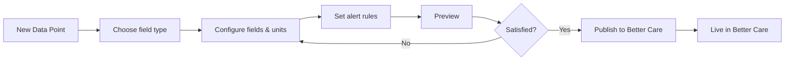

# Data Points Editor

The Data Points Editor is the primary authoring interface in Nourish Studio. It allows care home operators and implementation consultants to create, configure, and publish [[better-care/Data Points|Data Point definitions]] to their [[better-care/index|Better Care]] instance.

Understanding the [[better-care/Data Points|Data Points]] concept is a prerequisite for this page — the editor is the *authoring surface*; the runtime system lives in Better Care.

---

## User Flow



---

## Field Type Builder

The editor provides a visual builder for each [[better-care/Data Points#Field Types|field type]]:

### Single-value types

For `integer`, `decimal`, `boolean`, and `text` fields:
- **Label** — Display name shown to care staff
- **Unit** — Optional unit label (e.g. "kg", "°C", "bpm")
- **Min / Max** — Optional validation bounds (numeric types only)
- **Required** — Whether the field must be filled before saving

### Composite type

The `composite` builder lets operators add multiple sub-fields. Each sub-field has its own type, label, and validation. This is used for measurements like blood pressure (systolic + diastolic) or pain assessment (location + intensity + type).

### Enum type

A drag-and-drop list builder where operators define the allowed values. Order matters — the first item is the default.

---

## Alert Rule Builder

Operators can attach alert rules to any Data Point. The rule builder exposes:

| Setting | Description |
|---|---|
| Condition | A threshold expression (e.g. `value > 180`, `value.systolic > 180`) |
| Severity | `low`, `medium`, `high` |
| Notify | List of roles to notify (`care_assistant`, `nurse`, `gp`) |
| Message | Optional override message |

Conditions use a subset of JavaScript expression syntax, evaluated server-side by Better Care's `AlertEvaluator`. The editor provides a **live preview** of which test values would trigger the rule.

---

## Publish & Sync

When an operator publishes a Data Point, Studio calls:

```
POST /api/v1/data_point_definitions
```

on the [[better-care/API Reference#Data Points|Better Care API]]. If the org is offline, the definition is queued in SQLite and published automatically when connectivity is restored (see [[Architecture#Local-First Sync]]).

> [!warning] Published Data Points cannot change their schema
> Once a Data Point has been published and observations have been recorded against it, the [[better-care/Data Points#Field Types|schema is locked]]. The editor enforces this — locked fields are greyed out with a tooltip explaining why. To change the shape of a measurement, create a new Data Point and deprecate the old one.

---

## Related

- [[better-care/Data Points]] — The runtime system that consumes these definitions
- [[better-care/API Reference#Data Points]] — The API endpoint Studio calls
- [[Architecture#Local-First Sync]] — How drafts and queued publishes work offline
