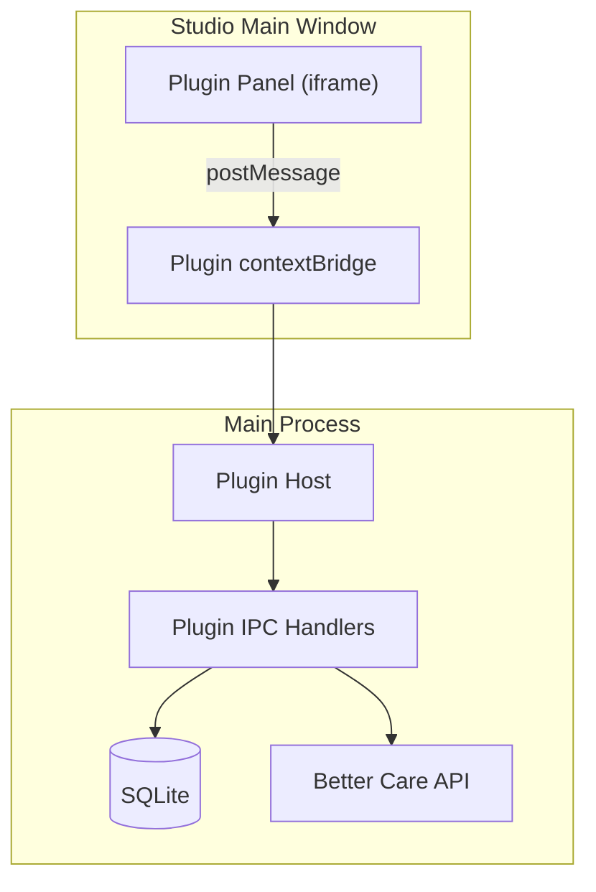

# Plugin System

Nourish Studio includes a plugin system that allows Nourish Professional Services and approved third-party integrators to add configuration screens for custom integrations — without shipping changes to the core Studio codebase.

> [!info] Availability
> The plugin system is currently in **private beta** with three approved partners. It is not generally available.

---

## Architecture

Plugins run in a **sandboxed iframe renderer** within Studio. They communicate with the main process via a restricted `StudioPlugin` API surface exposed through `contextBridge`. Plugins cannot access the OS, filesystem, or SQLite directly — all operations go through the plugin API.



---

## Plugin Manifest

Each plugin ships with a `studio-plugin.json` manifest:

```json
{
  "id": "com.example.my-integration",
  "name": "My Integration",
  "version": "1.2.0",
  "author": "Example Ltd",
  "entry": "dist/index.html",
  "permissions": [
    "org:read",
    "data_points:read",
    "custom_fields:write"
  ],
  "minStudioVersion": "3.0.0"
}
```

---

## Plugin API

Plugins receive a `studioPlugin` global object with the following API:

```typescript
interface StudioPlugin {
  // Org context
  org: {
    getId(): Promise<string>
    getSettings(): Promise<OrgSettings>
  }

  // Data Points (read-only for plugins)
  dataPoints: {
    list(): Promise<DataPointDefinition[]>
    get(slug: string): Promise<DataPointDefinition>
  }

  // Custom fields — write access for plugin-owned fields
  customFields: {
    save(field: CustomFieldInput): Promise<CustomField>
    delete(id: string): Promise<void>
  }

  // Toast notifications
  ui: {
    toast(message: string, type: 'info' | 'success' | 'error'): void
  }
}
```

---

## Permissions

| Permission | Grants |
|---|---|
| `org:read` | Organisation ID and settings |
| `data_points:read` | List and read [[better-care/Data Points\|Data Point definitions]] |
| `custom_fields:read` | Read plugin-owned custom field values |
| `custom_fields:write` | Create and delete plugin-owned custom fields |
| `sync:trigger` | Trigger a manual sync to [[better-care/index\|Better Care]] |

Permissions are declared in the manifest and shown to the operator at install time. Studio will not load a plugin that requests undeclared permissions.

---

## Installing a Plugin

Plugins are distributed as signed `.studioplugin` zip archives. Installation:

1. `Studio → Plugins → Install from file`
2. Select the `.studioplugin` file
3. Review permissions and confirm
4. Plugin appears in the left sidebar

> [!warning] Plugin signing
> Studio only loads plugins signed by a Nourish-issued certificate. Unsigned plugins are rejected at install time. Contact the Studio team to enrol as an approved plugin author.
